# Restaurant Management App — Module Maps
**Document type:** Product · Visual Reference  
**Version:** v1.0 | Last updated: 2026-03-15  
**Render with:** Any Markdown viewer that supports Mermaid (GitHub, Notion, Obsidian, VS Code + Mermaid plugin)

---

## How to read these maps

Each diagram uses a consistent colour convention:

| Colour | Meaning |
|--------|---------|
| 🟣 Purple | Foundation / cross-cutting |
| 🟡 Amber/Yellow | Phase 1 modules |
| 🟢 Green | Phase 2 modules |
| 🔵 Blue | Phase 3 modules |
| 🩷 Pink | Phase 4 modules |
| ⬜ Grey | Shared data / neutral nodes |

---

---

## MAP 1 — Full application module overview

All 15 modules across all four phases, showing phase groupings and the foundation layer.

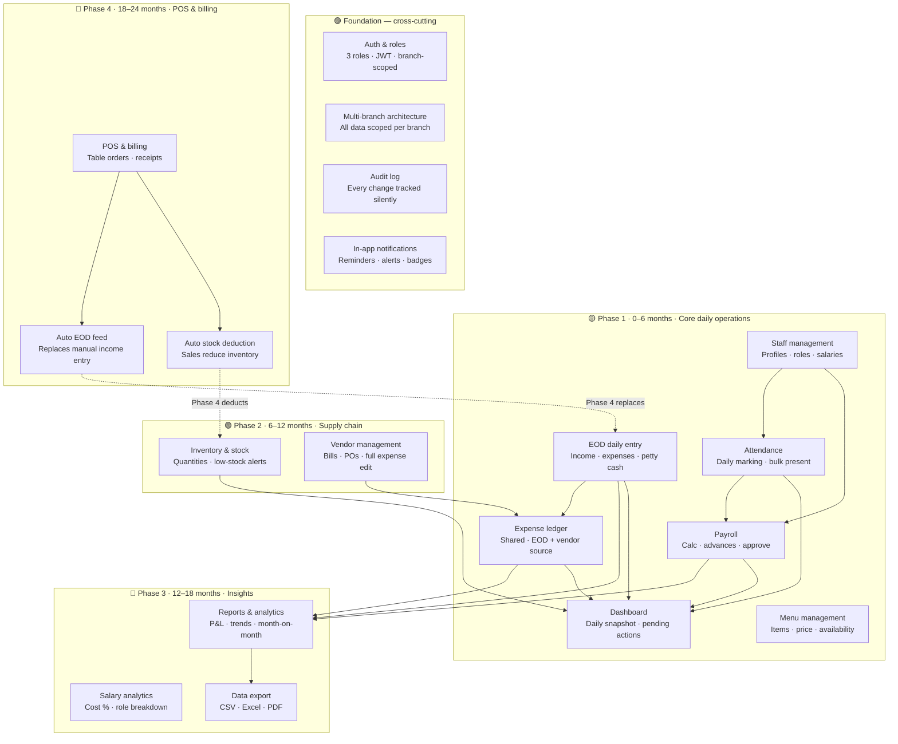

---

---

## MAP 2 — Data flow across modules

How data moves between modules from input to output.

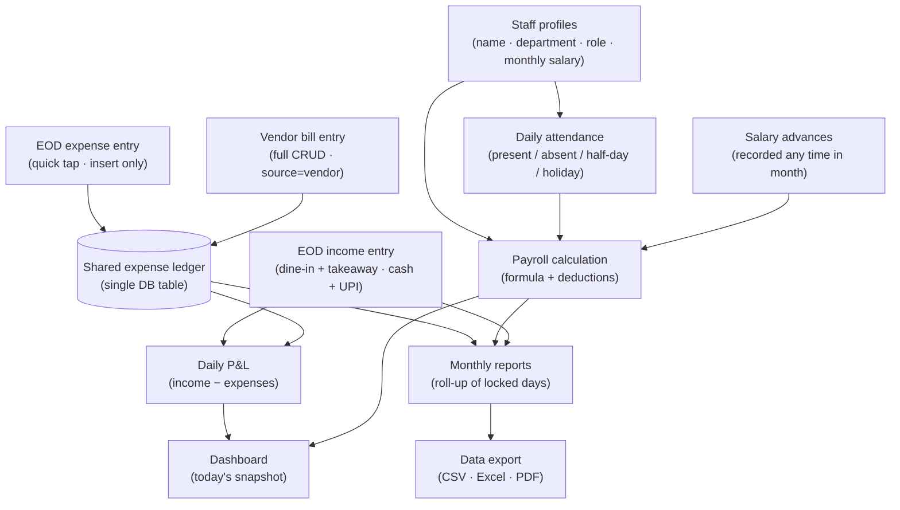

---

---

## MAP 3 — Auth & roles module

Who can do what, and how access is scoped to branches.

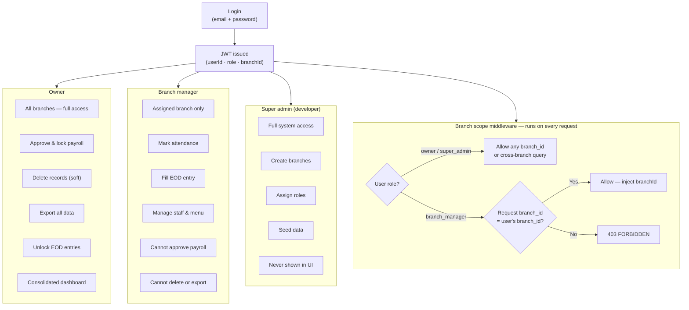

---

---

## MAP 4 — Staff management module

Full lifecycle of a staff member in the system.

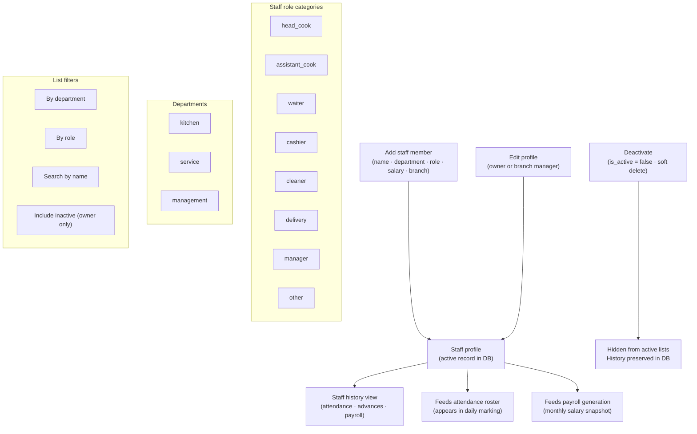

---

---

## MAP 5 — Attendance module

Daily marking flow optimised for 35+ staff.

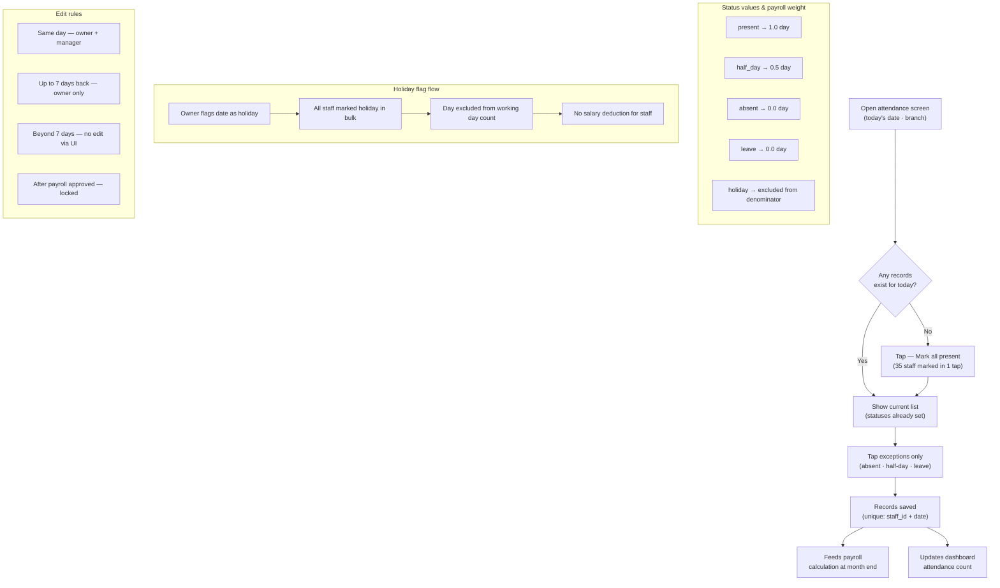

---

---

## MAP 6 — Payroll module

End-to-end from attendance records to locked salary slips.

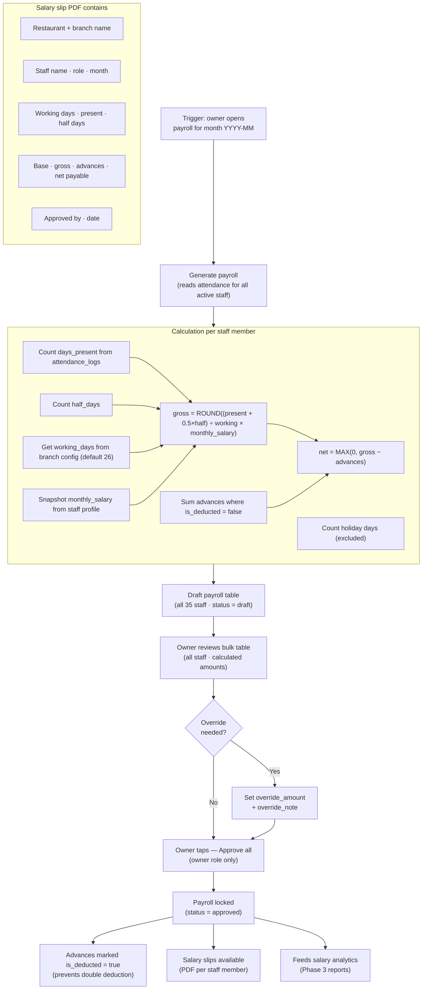

---

---

## MAP 7 — EOD daily entry module

The daily closing routine — income, expenses, petty cash, notes.

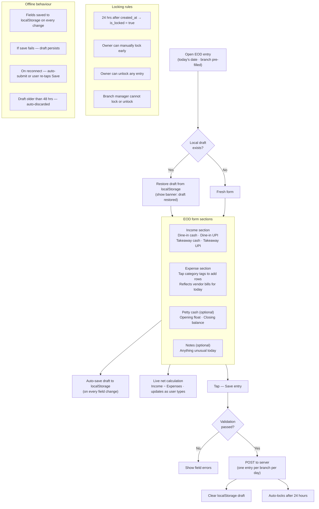

---

---

## MAP 8 — Shared expense ledger module

Single source of truth for all expenses — two entry points, one table.

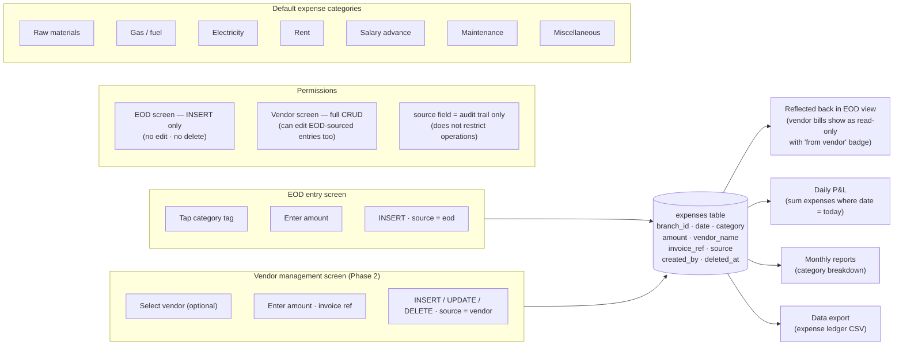

---

---

## MAP 9 — Dashboard module

What loads on the home screen and where every number comes from.

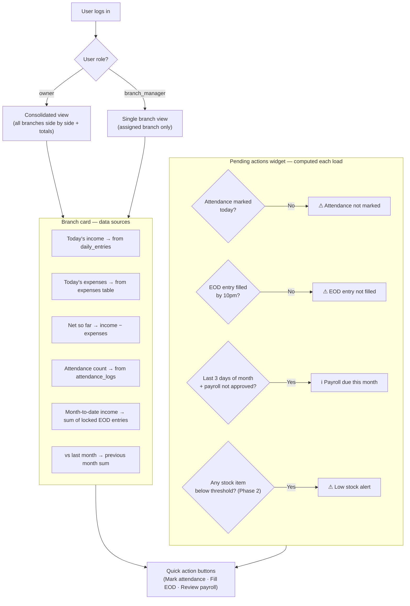

---

---

## MAP 10 — Inventory & stock module (Phase 2)

Stock tracking, adjustment history, and low-stock alert flow.

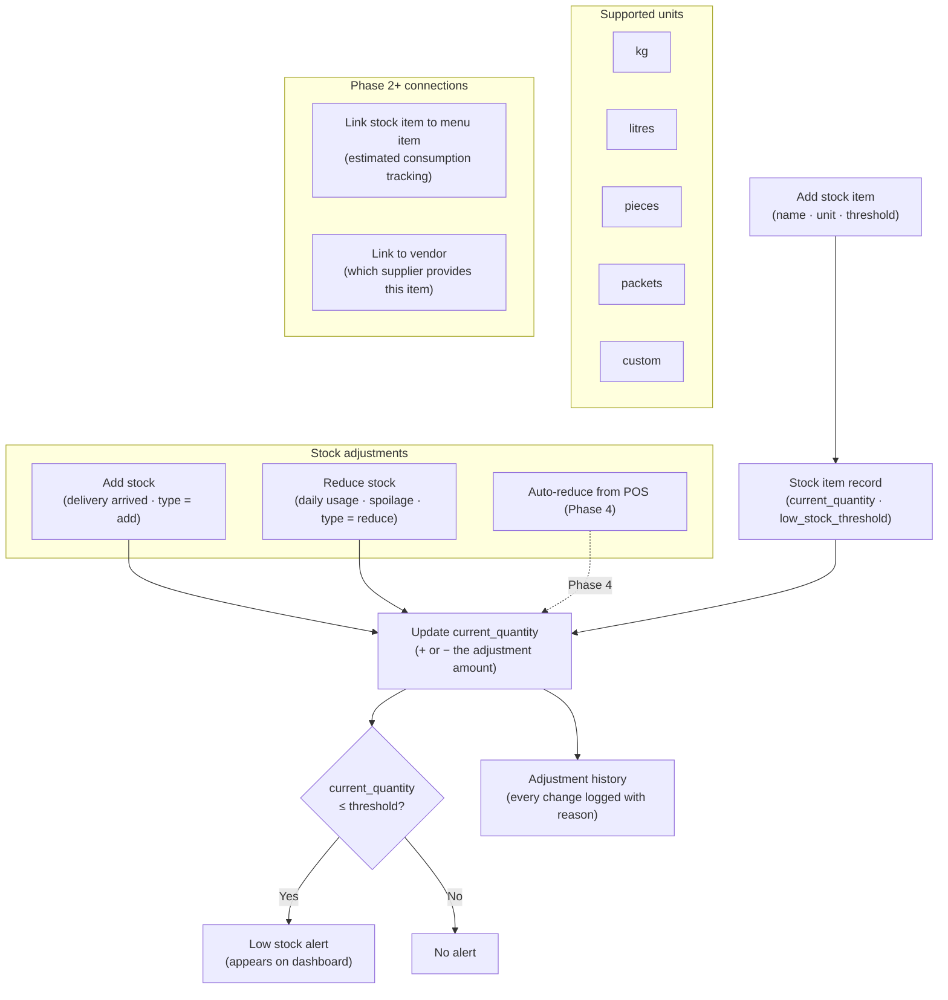

---

---

## MAP 11 — Vendor management module (Phase 2)

Supplier profiles, purchase bills, and full expense ledger control.

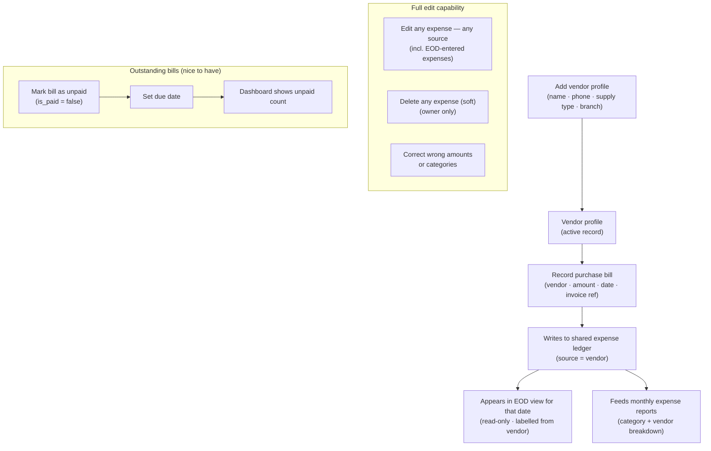

---

---

## MAP 12 — Reports & analytics module (Phase 3)

What gets calculated, how, and what can be exported.

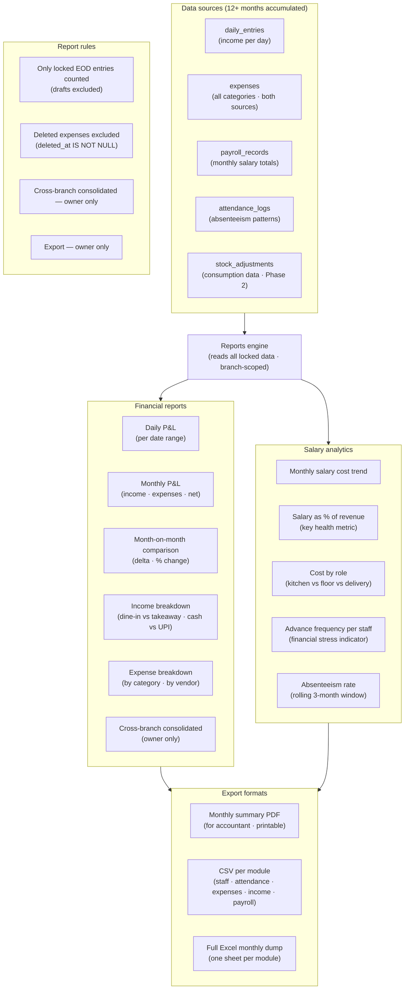

---

---

## MAP 13 — POS & billing module (Phase 4)

How POS integrates with the rest of the system and replaces manual entry.

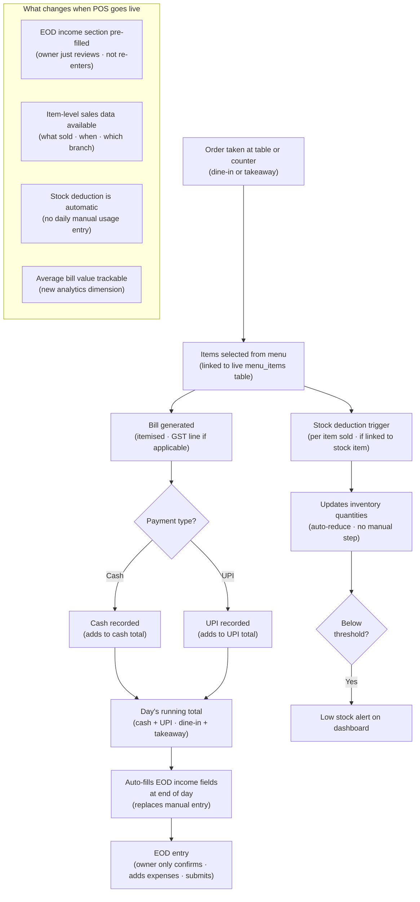

---

---

## Summary — module dependency order

The order in which modules must be built, because each depends on the previous.

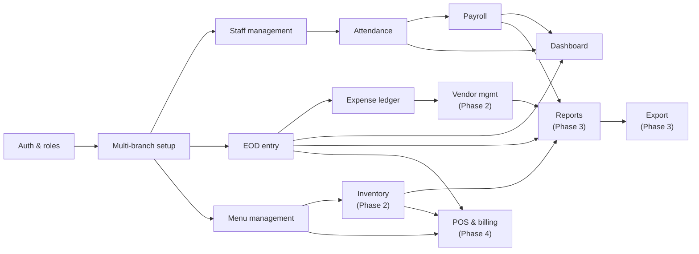
