# Sree Vaishnaves Management — Module Maps
**Document type:** Product · Visual Reference
**Version:** v2.0 | Last updated: 2026-09-30
**Render with:** any Markdown viewer that supports Mermaid (GitHub, VS Code + Mermaid, Obsidian)

These diagrams reflect the **implemented** system: a public website plus a management portal built on Next.js Server Actions over a JSON-blob store. Every module shown is built. Several are toggleable via `config.json`.

---

## MAP 1 — Application overview

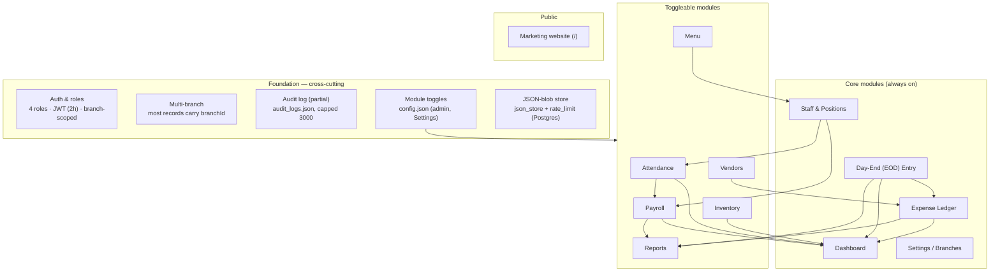
```mermaid
graph TD
  subgraph FOUNDATION["Foundation — cross-cutting"]
    AUTH["Auth & roles\n4 roles · JWT (2h) · branch-scoped"]
    MULTI["Multi-branch\nmost records carry branchId"]
    AUDIT["Audit log (partial)\naudit_logs.json, capped 3000"]
    CONFIG["Module toggles\nconfig.json (admin, Settings)"]
    STORE["JSON-blob store\njson_store + rate_limit (Postgres)"]
  end

  subgraph CORE["Core modules (always on)"]
    DASH["Dashboard"]
    STAFF["Staff & Positions"]
    EOD["Day-End (EOD) Entry"]
    EXP["Expense Ledger"]
    SET["Settings / Branches"]
  end

  subgraph TOGGLE["Toggleable modules"]
    ATT["Attendance"]
    PAY["Payroll"]
    VEN["Vendors"]
    INV["Inventory"]
    MENU["Menu"]
    REP["Reports"]
  end

  subgraph PUBLIC["Public"]
    WEB["Marketing website (/)"]
  end

  STAFF --> ATT
  ATT --> PAY
  STAFF --> PAY
  EOD --> EXP
  VEN --> EXP
  EXP --> REP
  PAY --> REP
  EOD --> REP
  INV --> DASH
  EXP --> DASH
  ATT --> DASH
  PAY --> DASH
  EOD --> DASH
  MENU --> STAFF
  CONFIG --> TOGGLE
```

---

## MAP 2 — Data flow across modules

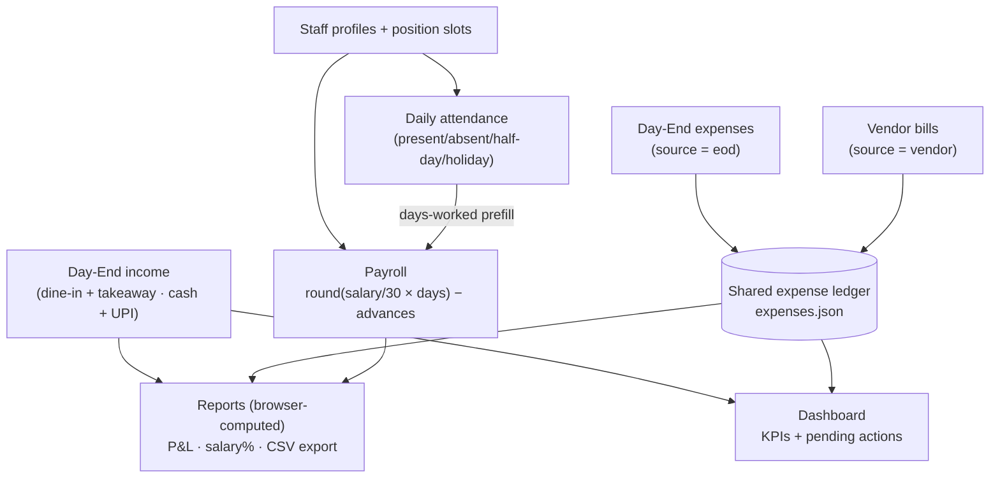
```mermaid
flowchart TD
  STAFF["Staff profiles + position slots"]
  ATT["Daily attendance\n(present/absent/half-day/holiday)"]
  EOD_INC["Day-End income\n(dine-in + takeaway · cash + UPI)"]
  EOD_EXP["Day-End expenses\n(source = eod)"]
  VEN_EXP["Vendor bills\n(source = vendor)"]
  LEDGER[("Shared expense ledger\nexpenses.json")]
  PAYROLL["Payroll\nround(salary/30 × days) − advances"]
  REPORTS["Reports (browser-computed)\nP&L · salary% · CSV export"]
  DASH["Dashboard\nKPIs + pending actions"]

  STAFF --> ATT
  STAFF --> PAYROLL
  ATT -->|days-worked prefill| PAYROLL
  EOD_INC --> DASH
  EOD_INC --> REPORTS
  EOD_EXP --> LEDGER
  VEN_EXP --> LEDGER
  LEDGER --> REPORTS
  LEDGER --> DASH
  PAYROLL --> REPORTS
```

---

## MAP 3 — Auth & roles

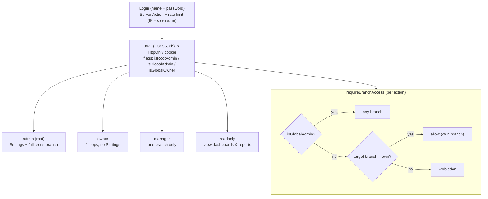
```mermaid
flowchart TD
  LOGIN["Login (name + password)\nServer Action + rate limit (IP + username)"]
  JWT["JWT (HS256, 2h) in HttpOnly cookie\nflags: isRootAdmin / isGlobalAdmin / isGlobalOwner"]
  LOGIN --> JWT

  JWT --> ADMIN["admin (root)\nSettings + full cross-branch"]
  JWT --> OWNER["owner\nfull ops, no Settings"]
  JWT --> MANAGER["manager\none branch only"]
  JWT --> READONLY["readonly\nview dashboards & reports"]

  JWT --> SCOPE
  subgraph SCOPE["requireBranchAccess (per action)"]
    Q{"isGlobalAdmin?"}
    Q -->|yes| ANY["any branch"]
    Q -->|no| CHK{"target branch = own?"}
    CHK -->|yes| OK["allow (own branch)"]
    CHK -->|no| DENY["Forbidden"]
  end
```

---

## MAP 4 — Staff & positions

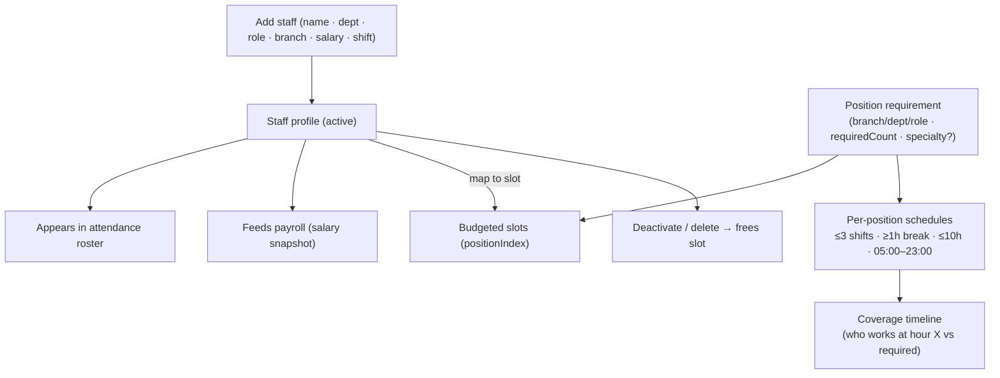
```mermaid
flowchart TD
  ADD["Add staff (name · dept · role · branch · salary · shift)"]
  PROFILE["Staff profile (active)"]
  ADD --> PROFILE
  PROFILE --> ATT_FEED["Appears in attendance roster"]
  PROFILE --> PAY_FEED["Feeds payroll (salary snapshot)"]

  REQ["Position requirement\n(branch/dept/role · requiredCount · specialty?)"]
  REQ --> SLOT["Budgeted slots (positionIndex)"]
  PROFILE -->|map to slot| SLOT
  REQ --> SCHED["Per-position schedules\n≤3 shifts · ≥1h break · ≤10h · 05:00–23:00"]
  SCHED --> TIMELINE["Coverage timeline\n(who works at hour X vs required)"]

  DEACT["Deactivate / delete → frees slot"]
  PROFILE --> DEACT
```

---

## MAP 5 — Attendance

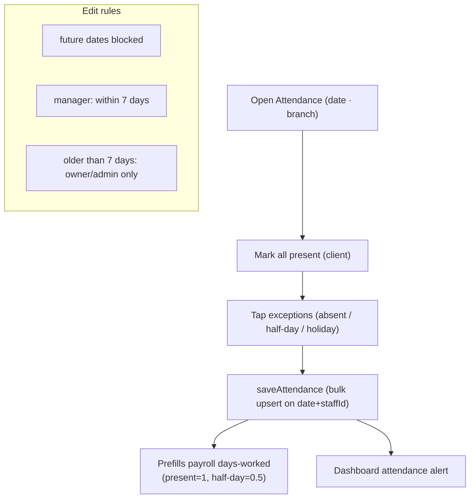
```mermaid
flowchart TD
  OPEN["Open Attendance (date · branch)"]
  BULK["Mark all present (client)"]
  EXC["Tap exceptions (absent / half-day / holiday)"]
  SAVE["saveAttendance (bulk upsert on date+staffId)"]
  OPEN --> BULK --> EXC --> SAVE

  subgraph RULES["Edit rules"]
    R1["future dates blocked"]
    R2["manager: within 7 days"]
    R3["older than 7 days: owner/admin only"]
  end
  SAVE --> PAYFEED["Prefills payroll days-worked\n(present=1, half-day=0.5)"]
  SAVE --> DASHFEED["Dashboard attendance alert"]
```

---

## MAP 6 — Payroll

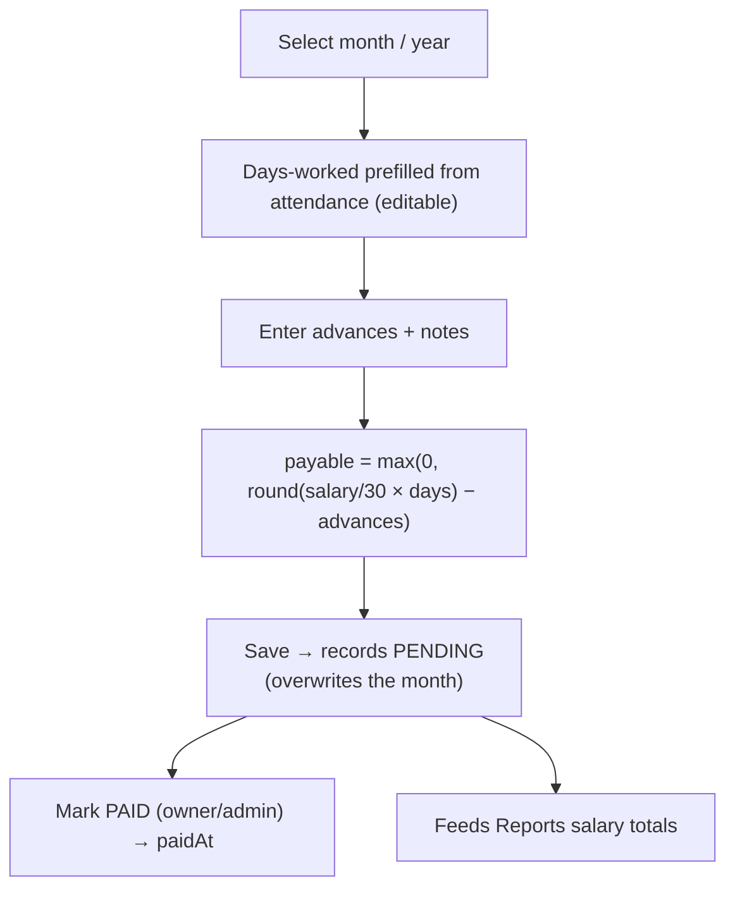
```mermaid
flowchart TD
  SEL["Select month / year"]
  PREFILL["Days-worked prefilled from attendance (editable)"]
  ENTER["Enter advances + notes"]
  CALC["payable = max(0, round(salary/30 × days) − advances)"]
  SAVEP["Save → records PENDING\n(overwrites the month)"]
  PAID["Mark PAID (owner/admin) → paidAt"]
  SEL --> PREFILL --> ENTER --> CALC --> SAVEP --> PAID
  SAVEP --> REPFEED["Feeds Reports salary totals"]
```

---

## MAP 7 — Day-End (EOD) entry

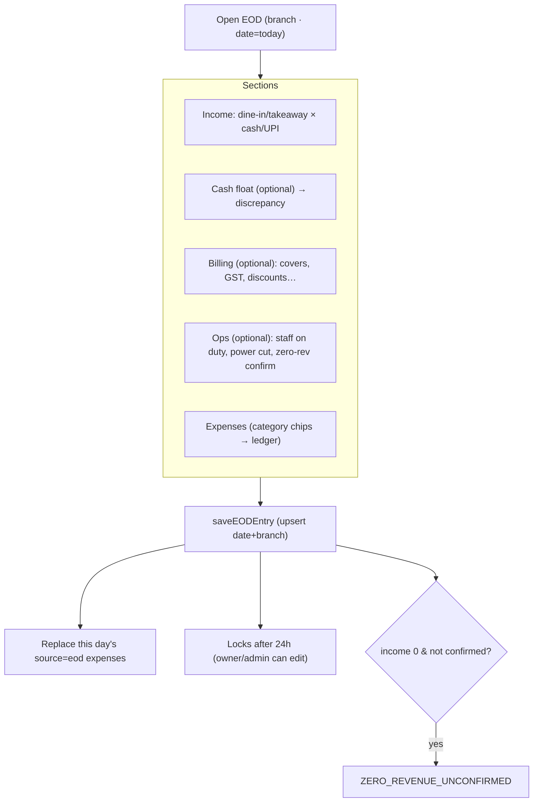
```mermaid
flowchart TD
  OPEN["Open EOD (branch · date=today)"]
  subgraph FORM["Sections"]
    INC["Income: dine-in/takeaway × cash/UPI"]
    FLOAT["Cash float (optional) → discrepancy"]
    BILL["Billing (optional): covers, GST, discounts…"]
    OPS["Ops (optional): staff on duty, power cut, zero-rev confirm"]
    EXP["Expenses (category chips → ledger)"]
  end
  OPEN --> FORM --> SAVE["saveEODEntry (upsert date+branch)"]
  SAVE --> REPLACE["Replace this day's source=eod expenses"]
  SAVE --> LOCK["Locks after 24h (owner/admin can edit)"]
  SAVE --> ZERO{"income 0 & not confirmed?"} -->|yes| BLOCK["ZERO_REVENUE_UNCONFIRMED"]
```

---

## MAP 8 — Shared expense ledger

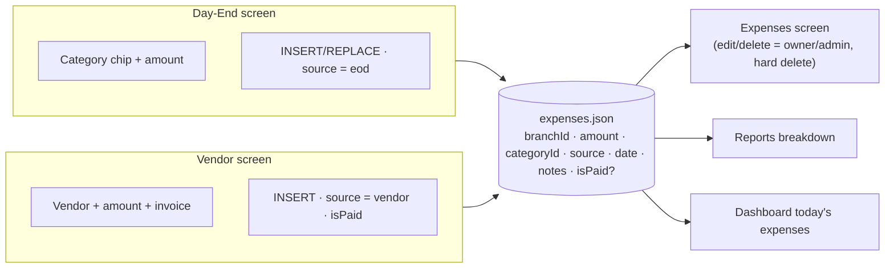
```mermaid
flowchart LR
  subgraph EOD_ENTRY["Day-End screen"]
    E1["Category chip + amount"]
    E2["INSERT/REPLACE · source = eod"]
  end
  subgraph VEN_SCREEN["Vendor screen"]
    V1["Vendor + amount + invoice"]
    V2["INSERT · source = vendor · isPaid"]
  end
  EOD_ENTRY --> LEDGER
  VEN_SCREEN --> LEDGER
  LEDGER[("expenses.json\nbranchId · amount · categoryId · source · date · notes · isPaid?")]
  LEDGER --> EXPVIEW["Expenses screen\n(edit/delete = owner/admin, hard delete)"]
  LEDGER --> REPORTS["Reports breakdown"]
  LEDGER --> DASH["Dashboard today's expenses"]
```

---

## MAP 9 — Dashboard

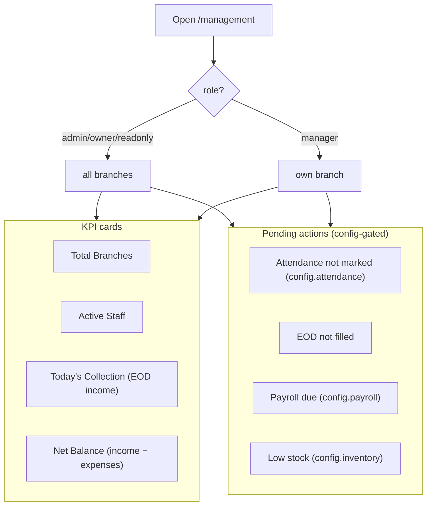
```mermaid
flowchart TD
  LOGIN["Open /management"]
  LOGIN --> SCOPEQ{"role?"}
  SCOPEQ -->|admin/owner/readonly| ALL["all branches"]
  SCOPEQ -->|manager| ONE["own branch"]

  subgraph KPI["KPI cards"]
    K1["Total Branches"]
    K2["Active Staff"]
    K3["Today's Collection (EOD income)"]
    K4["Net Balance (income − expenses)"]
  end

  subgraph PENDING["Pending actions (config-gated)"]
    P1["Attendance not marked (config.attendance)"]
    P2["EOD not filled"]
    P3["Payroll due (config.payroll)"]
    P4["Low stock (config.inventory)"]
  end

  ALL --> KPI
  ONE --> KPI
  ALL --> PENDING
  ONE --> PENDING
```

---

## MAP 10 — Inventory

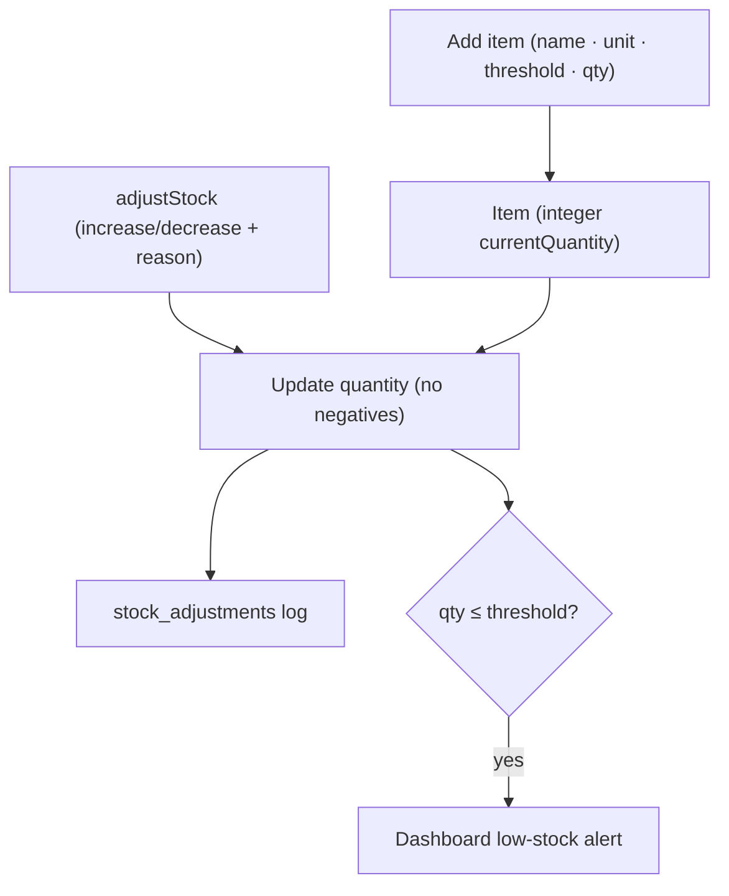
```mermaid
flowchart TD
  ADD["Add item (name · unit · threshold · qty)"]
  ITEM["Item (integer currentQuantity)"]
  ADD --> ITEM
  ADJ["adjustStock (increase/decrease + reason)"]
  ADJ --> UPDATE["Update quantity (no negatives)"]
  ITEM --> UPDATE
  UPDATE --> LOG["stock_adjustments log"]
  UPDATE --> CHK{"qty ≤ threshold?"}
  CHK -->|yes| ALERT["Dashboard low-stock alert"]
```

---

## MAP 11 — Vendors

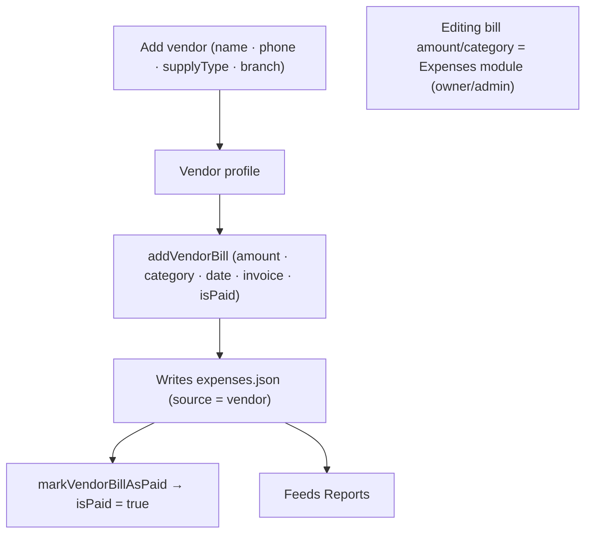
```mermaid
flowchart TD
  ADDV["Add vendor (name · phone · supplyType · branch)"]
  VP["Vendor profile"]
  ADDV --> VP
  VP --> BILL["addVendorBill (amount · category · date · invoice · isPaid)"]
  BILL --> LEDGER["Writes expenses.json (source = vendor)"]
  LEDGER --> PAID["markVendorBillAsPaid → isPaid = true"]
  LEDGER --> REPORTS["Feeds Reports"]
  note["Editing bill amount/category = Expenses module (owner/admin)"]
```

---

## MAP 12 — Menu (global + per-branch overrides)

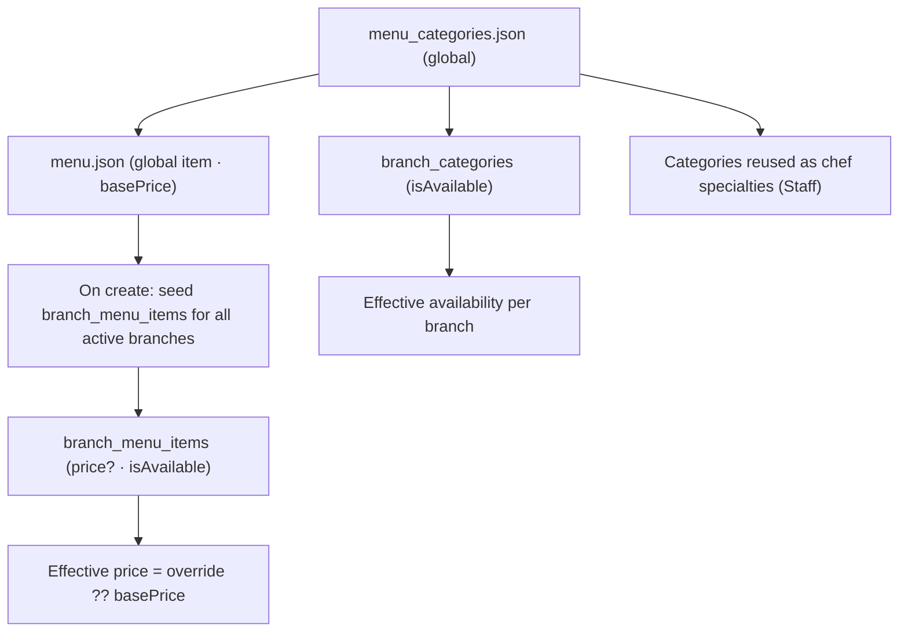
```mermaid
flowchart TD
  CAT["menu_categories.json (global)"]
  ITEM["menu.json (global item · basePrice)"]
  CAT --> ITEM
  ITEM --> SEED["On create: seed branch_menu_items for all active branches"]
  SEED --> BMI["branch_menu_items (price? · isAvailable)"]
  CAT --> BCAT["branch_categories (isAvailable)"]
  BMI --> EFF["Effective price = override ?? basePrice"]
  BCAT --> EFFAVAIL["Effective availability per branch"]
  CAT --> SPEC["Categories reused as chef specialties (Staff)"]
```

---

## MAP 13 — Reports (browser-computed)

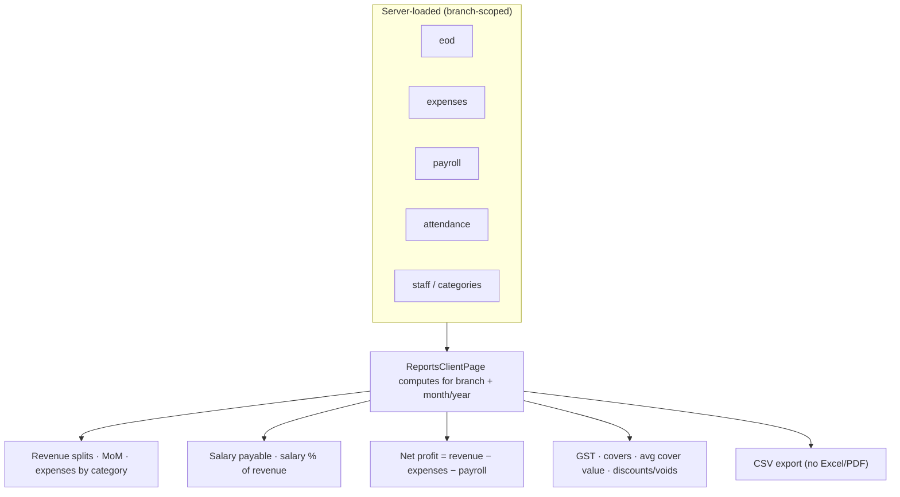
```mermaid
flowchart TD
  subgraph INPUTS["Server-loaded (branch-scoped)"]
    I1["eod"]
    I2["expenses"]
    I3["payroll"]
    I4["attendance"]
    I5["staff / categories"]
  end
  INPUTS --> CLIENT["ReportsClientPage computes for branch + month/year"]
  CLIENT --> FIN["Revenue splits · MoM · expenses by category"]
  CLIENT --> SAL["Salary payable · salary % of revenue"]
  CLIENT --> NET["Net profit = revenue − expenses − payroll"]
  CLIENT --> BILLM["GST · covers · avg cover value · discounts/voids"]
  CLIENT --> CSV["CSV export (no Excel/PDF)"]
```

---

## Summary — module relationships

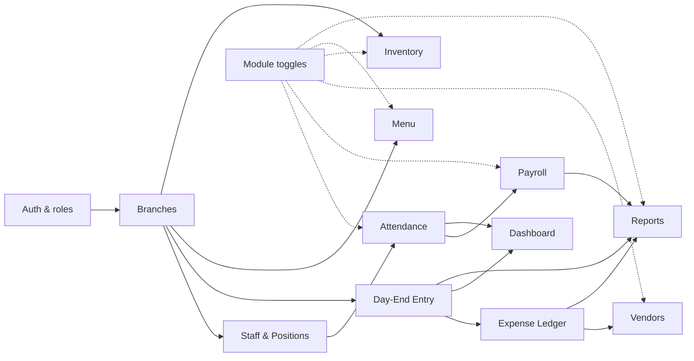
```mermaid
graph LR
  AUTH["Auth & roles"] --> BRANCH["Branches"]
  BRANCH --> STAFF["Staff & Positions"]
  STAFF --> ATT["Attendance"]
  ATT --> PAY["Payroll"]
  BRANCH --> EOD["Day-End Entry"]
  EOD --> EXP["Expense Ledger"]
  EXP --> VEN["Vendors"]
  BRANCH --> MENU["Menu"]
  BRANCH --> INV["Inventory"]
  EOD --> DASH["Dashboard"]
  ATT --> DASH
  PAY --> REP["Reports"]
  EXP --> REP
  EOD --> REP
  CONFIG["Module toggles"] -.-> ATT
  CONFIG -.-> PAY
  CONFIG -.-> VEN
  CONFIG -.-> INV
  CONFIG -.-> MENU
  CONFIG -.-> REP
```
